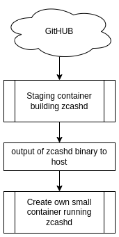

# ZCash builder script 
Building ZCash docker image more sophisticated way.

## Purpose

zcashd is generally available via docker hub as `electriccoinco/zcashd`. The reason I created this script is the trust issue. When you run this docker image and perform sha256sum on the zcashd the hash will be different then the one when you build locally from the source because part of the file metadata is date stamp, so every day building from same source the hash will be different.

What does it mean? It is possible that `electriccoinco` could inject malicious code, a tracker and send info via HTTP or even P2P to whoever. They unlikely would do it but how can you tell, will you change the date on your local, build and hope for same sha256 hash?

Assuming the source code itself is clean, it's better to build it yourself. The problem is you need installed lots of dependencies and the Docker file will grab all the source (and failed build for me) and for them result in an image of 1.3GB in size. So I decided to take different approach, and build zcashd in staging container, take the build binary to host and then build actual container that resulted in ~162MB 

## How it works 

The main `build.sh` script will run staging container that will be automatically deleted.
Staging container will run `src/build-zcashd.sh`. It does all necessary installation of GO and others, it checks GitHub for latest release tag version, clones the repo and uses that tag source. The output will be created in Host machine and then another command from the main script will build actual docker image using same (tweaked) template as can be found in https://github.com/zcash/lightwalletd. 

## Building
While you don't need to install GO, you still need docker, oh no! but most people who need a container, do have docker installed, or they have a VPS that has docker installed.  
Building is as simple as running (on Linux)
`./build.sh`

### Thoughts 
The script could be improved to take git tag version, so any version could have been built, not just latest.

You can modify the script to take your repository if forked and build your own version

If you think it wasn't necessary to do it like that, maybe, but it was fun.
